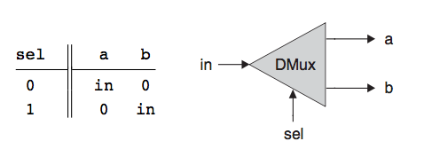
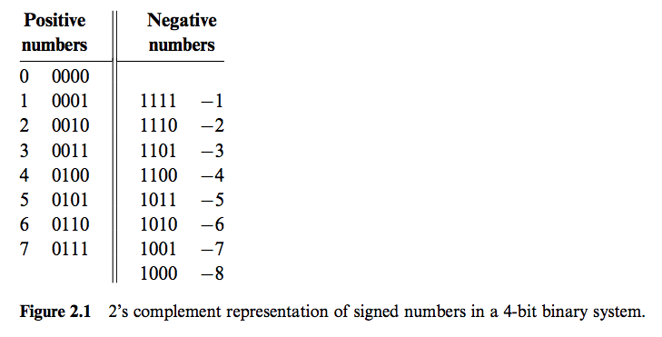
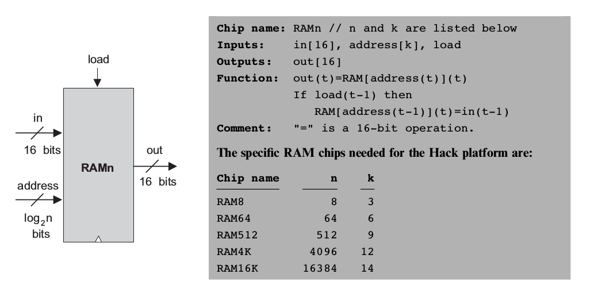
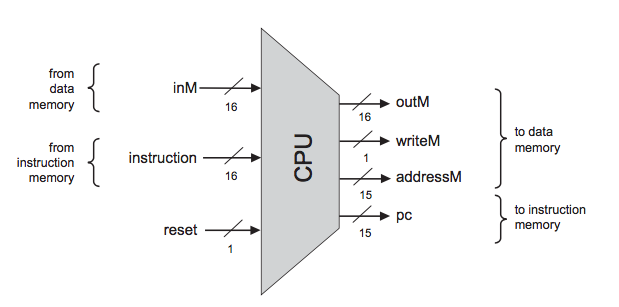
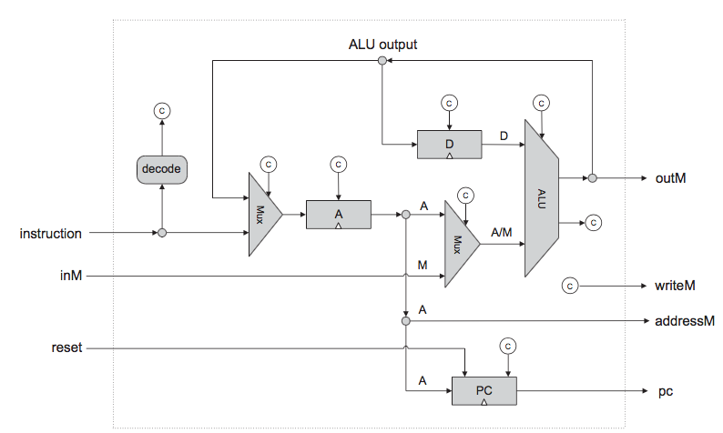
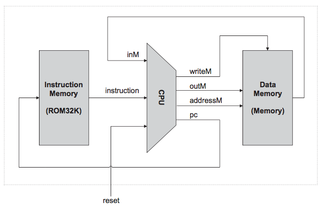
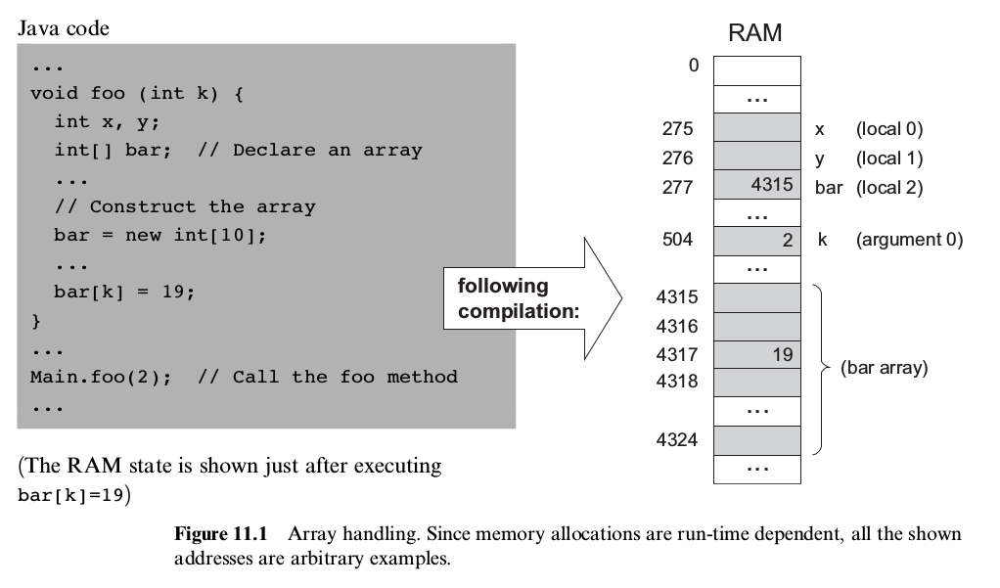
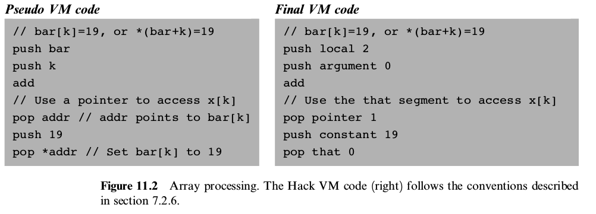
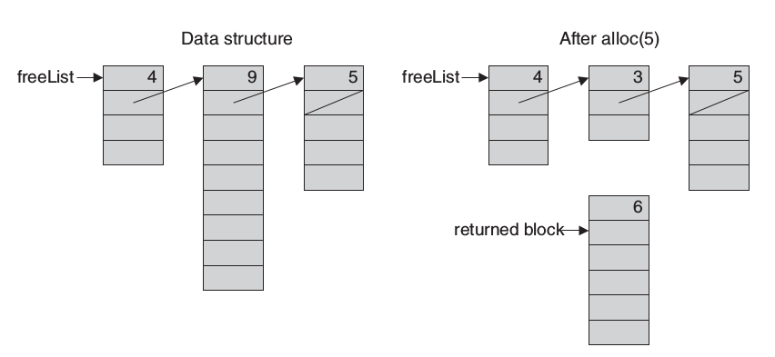

  
  <h1 align="center" style="border-bottom: none"><b>From Nand2Tetris</b></h1>

  

    As a Computer Science Student at the <a href="https://new.huji.ac.il/"><b>Hebrew University of Jerusalem</b></a>, I took the <b>From Nand to Tetris</b> course.
     
    This course covers logic gates, hardware, compilers, and operating systems, using <b>Python</b> as the main language.
     
    It lasted <b>13 weeks</b>, during which we submitted a total of 12 exercises covering various topics.
     
     
    More information can be found <a href="https://shnaton.huji.ac.il/index.php/NewSyl/67925/2/2022/">here</a>.
  

 

### [Chapter 1: Boolean logic]
* **Truth table representation**
* **Canonical representation**
* **Logic gates**
    * Nand(a, b)
    * Not(in)
    * And(a, b)
    * Or(a, b)
    * Xor(a, b)
    * Mux(a, b, sel) multiplexor choose one from many
      
    
    * DMux(in, sel)
      
    

### [Chapter 2: Boolean arithmetic]
* **Signed Binary Number**: Most computer systems today use the method called *2's complement*, aka *radix complement*. In 2's complement of n bits, x + (minus) x = 2 to the n. With *radix complement* we don't need to care about subtraction operation. We can subtract with add operation. That's super cool. So we only need Adders chip.
  
    

* **HalfAdder**
  
    

* **Full Adder**
  
    

* **ALU**
  
    

### [Chapter 3: Sequential logic]
* **Combinational vs Sequential Logic**
    
    * **Combinational Logic**: An implementation of boolean function. The output depends on only the input. Meaning with a certain input there is a certain output.
    * **Sequential Logic**
        * Use clock
        * Maintain state
        * Output depends on input and the current state

* **Data Flip-Flop (DFF)** contains a clock input, a gate's input and a gate's output. DFF behavior is *out(t) = in(t-1)* where t is the current clock cycle. 

* **1-bit Register (Bit)** is a storage device. It can *store*(remember) a value over time. Its behavior is *out(t) = out(t-1)*
    

* **Memory**
    

### [Chapter 4: Machine language]
* **A Instruction**
    
* **C Instruction**
    

### [Chapter 5: Computer architecture]
* **Central Processing Unit (CPU) of Hack Computer**
    * *CPU Abstraction*
        
    * *CPU Implementation*
        
    
* **Hack Architecture**
    

### [Chapter 6: Assembler]
    

* **Symbols**
    * *Label symbols* (In the program above *LOOP* and *END* are label symbols) are used to mark the memory location of the next instruction in the program. Label symbols are used for *control flow* in the program.
    * *Variable symbols* (In the program above *i* and *sum* are variable symbols) are treated as *variable*. Variables are mapped to consecutive memory locations.
    
* **Symbols table**: Since Hack instructions can contain symbols, the symbols must be resolved into actual addresses.

    | Symbol     | Memory location |
    | :-------   | :----------:    |
    | i          | 16              |
    | sum        | 17              |
    | LOOP       | 4               |
    | END        | 18              |

    The table above is the symbol table for the program above. Since in Hack system we allocate memory for variable from memory 16 so the memory location for variable *i* will be 16 and *sum* will be 17. To specify label *LOOP* and *END* we count the number of instructions in the program so that *LOOP* will be 4 and *END* will be 18. 

### [Chapter 7: Virtual machine I - Stack arithmetic]

### [Chapter 8: Virtual machine II - Program control]

### [Chapter 9: High-level language]

### [Chapter 10: Compiler I - Syntax analysis]

### [Chapter 11: Compiler II - Code generation]
The compilation of high-level programming language into a low-level one focuses on 2 main issues: ***data translation*** and ***command translation***
#### 11.1 Data translation
* **Variables** For variables we need to care about some of its properties
    * *type*: integer, char, boolean, array, object
    * *kind*: field, static, local, argument
    * *scope*: class level, subroutine level
* **Symbol table**: A data structure to keep track all *identifiers*. Whenever a new *identifier* is encountered for the first time the compiler adds its description to *symbol table*. When an *identifier* is encountered elsewhere in the source code the compiler looks it up in symbol table and get all information needed from symbol table.
    

* **Handling variable**

* **Handling object**
    

* **Handling array**
    

#### 11.2 Command translation
* **Handling expression**

* **Handling flow of control**

### [Chapter 12: Operating system]
* **Memory management**
    * *Heap management*
        
